# Developer Guide

## File Structure

This diagram provides an overview of the repository's organization to help developers navigate and understand the codebase. Key components include:

- **app**: Contains the Streamlit interface and session management
- **tools**: Houses micro and macro agent functionality 
- **router**: Implements the agent routing logic with LangGraph
- **rag**: Contains retrieval-augmented generation components
- **utils**: Provides supporting utilities for file handling and logging

The arrows indicate dependencies between components. When extending the system, please maintain this separation of concerns to keep the codebase modular and maintainable.